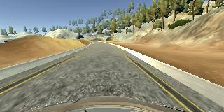

# **Behavioral Cloning** 

## Track1 Video

<p align="center">
 <a href="https://www.youtube.com/embed/VYj63bDL_ag"></a>
 <br>run1.mp4. (click for full video)
</p>

## Abstract

**Behavioral Cloning Project**

In this project, I followd the approach presented by [Nvidia](http://images.nvidia.com/content/tegra/automotive/images/2016/solutions/pdf/end-to-end-dl-using-px.pdf). This is introduced in even more powerful network project video. I skipped trying LeNet because it is already used in traffic sign classifier project and more suitable for recognition work.

Data collection and testing are performed in a simulator provided by Udacity. Actually, I used Udacity sample
driving data for final training. Because my self collected data does not work well.

Since the sample data only consists first track, the trained model manages to successfully drive the car
indefinitely in track1. In track2, it will quickly crash into one guardrail. More time is needed on fine
tuned data collection on track2.

The goals / steps of this project are the following:
* Use the simulator to collect data of good driving behavior
* Build, a convolution neural network in Keras that predicts steering angles from images
* Train and validate the model with a training and validation set
* Test that the model successfully drives around track one without leaving the road
* Summarize the results with a written report

[//]: # (Image References)

[image1a]: ./images/arch.png "Model Architecture"
[image1b]: ./images/model_summary.png "Model Summary"
[image3a]: ./images/3_camera.png "3 Camera"
[image3b]: ./images/flip.png "Flip"
[image3c]: ./images/shift.png "Shift"

## Rubric Points
### Here I will consider the [rubric points](https://review.udacity.com/#!/rubrics/432/view) individually and describe how I addressed each point in my implementation.  

---
### Files Submitted & Code Quality

#### 1. Submission includes all required files and can be used to run the simulator in autonomous mode

My project includes the following files:
* [model.py](https://github.com/seekdestiny/CarND-Behavioral-Cloning-P3/blob/master/model.py) containing the script to create and train the model
* [preprocess_input.py](https://github.com/seekdestiny/CarND-Behavioral-Cloning-P3/blob/master/preprocess_input.py) is used to put all image preprocessed trials together
* [drive.py](https://github.com/seekdestiny/CarND-Behavioral-Cloning-P3/blob/master/drive.py) for driving the car in autonomous mode
* [model.h5](https://github.com/seekdestiny/CarND-Behavioral-Cloning-P3/blob/master/models/model.h5) containing a trained convolution neural network 
* [writeup_report.md](https://github.com/seekdestiny/CarND-Behavioral-Cloning-P3/blob/master/README.md) summarizing the results

#### 2. Submission includes functional code
Using the Udacity provided simulator and my drive.py file, the car can be driven autonomously around the track by executing 
```sh
python drive.py model.h5
```

#### 3. Submission code is usable and readable

The model.py file contains the code for training and saving the convolution neural network. The file shows the pipeline I used for training and validating the model, and it contains comments to explain how the code works.

The basic pipeline is implemented in build_model function. It parsed the csv log file, define model and train
it. 

```python
def build_model(log_file_path, n_epochs, save_dir):
    """ Builds and trains the network given the input data in train_dir """

    # Get training and validation data
    X, y = get_training_data(log_file_path)

    # Build and train the network
    model = define_model()
    train_model(model, save_dir, n_epochs, X, y)
```

### Model Architecture and Training Strategy

#### 1. An appropriate model architecture has been employed

I have implemented the convolutional neural network proposed by
[Nvidia](http://images.nvidia.com/content/tegra/automotive/images/2016/solutions/pdf/end-to-end-dl-using-px.pdf).
The following picture summarizes the model:

![alt text][image1a]

The architecture is a combination of Convolutional layers
followed by Fully-Connected layers, since the input data is a raw RGB image.
This time, the architecture is applied to a **regression problem** (predicting
steering angle) instead of classification, so no activation function
or softmax must be applied at the last layer, which will have only one neuron.

I also considered transfer learning tech introduced in lecture. But
after some quick trial on AlexNet, I found it is more suitable for recognition job
instead of regression problem. And retraining all weights from the scatch is
computation resource limited which makes it impossible. 

The implemented network consists of the following layers:

- **Input**. Image of size (66, 200, 3). I crop original (160, 320, 3) size to this.
- **Normalization** to the range [-0.5, 0.5]. This is performed using a _Lambda_ in Keras.
- **Convolutional 1**. 24 filters of size 5x5x3 (since the input has 3 channels).
The filter is applied with strides of (2, 2) instead of using MaxPooling.
This can be done because the input image is relatively high resolution.
The used padding was 'valid', as proposed by Nvidia.

- **Convolutional 2**. 36 filters of size 5x5x24. Strides of (2, 2).
- **Convolutional 3**. 48 filters of size 5x5x36. Strides of (2, 2).
- **Convolutional 4**. 64 filters of size 3x3x48. Strides of (1, 1). As can be
observed, the filter size and strides are now reduced, given that the input
images are much smaller.
- **Convolutional 5**. 64 filters of size 3x3x64. Strides of (1, 1).

- **Flatten**. The input for the next layer will have size 1152.
- **Dropout** to mitigate the effects of overfitting.

- **Fully Connected 1**, with 100 neurons + Dropout.
- **Fully Connected 2**, with 50 neurons + Dropout.
- **Fully Connected 3**, with 10 neurons + Dropout.
- **Fully Connected 4**, with 1 neuron, being the output.

All the layers, except for the output layer, have a **ELU activation function**.
The motivation to prefer it over ReLU is that it has a continuous derivative
and x = 0 and does not kill negative activations. The result is a bit smoother
steering output.

**Dropout with probability of keeping = 0.25** is used 
in order to prevent overfitting and have a smooth output.

In addition, all the layers are initialized with the 'glorot_uniform' function,
default in Keras.
The main improvement over Nvidia's implementation is to add the Dropout
layers in order to fight against overfitting.

In total the network has **252219 parameters**, including weights and biases.
The model summary is attached by calling model.summary in Keras:

![alt text][image1b]

#### 2. Attempts to reduce overfitting in the model

The model contains dropout layers in order to reduce overfitting (model.py lines 164 - 176). 

Four drop layers are added after flatten and fully-connected layers as shown above.

The model was trained and validated on different data sets to ensure that the model was not overfitting.
(model.py lines 65-117)

I use different generators for validation and train data set. Basically, train data set has data augmentation
technique involded while validation data set not.

The model was tested by running it through the simulator and ensuring that the vehicle could stay on the track.

#### 3. Model parameter tuning

- **Optimization parameter**: Use Mean Square Error (mse) instead of cross_entropy, 
since this is a regression problem.

- **Optimizer**: Adam, given the great performance on the Traffic Signs Lab.
We use a learning rate of 0.001 (default value). Smaller values like 0.0001 and
0.00001 were also tested, but 0.001 gave the best performance.

- **Batch size**: 64 (or 128), to fit in GPU memory.

- **Number of training samples**: 8036. I tried to put own collected data and udacity
data together which has around 20000 samples. But later I found my own data just
introduce more loss so I finally use 8036 samples of udacity for final training.

- **Maximum number of epochs**: 1. I started by 20 epochs but I quickly noticed
it takes much effort to train it even if I run it in workspace. Then I tried
5 epochs, observed loss and then tested each epoch's model by using callbacks tech. 
I found with data augmentation and proper parameter tuning only one epoch can also 
provide good result on track1. And only one epoch can take 10 mins train because
I have only one tesla gpu available in workspace.

- **Callbacks**: I implement a callback to save the model after every epoch, in
case the validation loss oscillated during train procedure. The train time cost
is really high even if the architecture is relatively simple compared to other
famous CNN. So, it is important to save all midstep model. This way we can compare
different models while skipping the ones with worse perforance. This is
implemented in the `EpochSaverCallback` class:

```python
class EpochSaverCallback(Callback):
    def __init__(self, out_dir):
        self.out_dir = out_dir

    def on_train_begin(self, logs={}):
        self.losses = []

    def on_epoch_end(self, epoch, logs={}):
        current_loss = logs.get('val_loss')

        if not self.losses or current_loss < np.amin(self.losses):
            out_dir = os.path.join(self.out_dir, 'e' + str(epoch+1))
            save_model(out_dir, self.model)

        self.losses.append(current_loss)
```
#### 4. Appropriate training data

Training data was chosen to keep the vehicle driving on the road. I used a combination of center lane driving, recovering from the left and right sides of the road. 

I employed data augmentation to improve final test result. This is described
in later section.

I also try to collect data myself to generalize the train data set.
However, using mouse or keyboard to generate clean data is very challenge
part for this project. I often press keyboard too hard or hold the key a little
longer to cread relative big steering angle, not mentioned to control the car
at some constant speed (sometimes too fast or sometimes too slow).
Variated speed seems to introduce weird behavior in final test result.

And since controlling the car is difficult, many movements from center to side is
recorded in the dataset. It is hard to remove them by hitting record button to
pause or restart recording every time. 

So, finally I decided to take advantage of **dataset from Udacity** which works
at least well for track1 test. 

##### Strategy
During my own collection, I try some stuff mentioned in project introduction videos to record data.

- **Normal driving**, with the vehicle kept in the center of the road.
Drive a few laps instead of only one to collect enough data.

- **Recovery**. I tried to create movement from side to center.
I drove towards the left or right edge of the road,
without recording. Then I turned on recording, and steered the vehicle back on
track. This was performed at different distances from the center of the lane.
But I can only do it in very low speed otherwise the car will cross the center to
move towards another side. I add the recovery data point to dataset but the car
still get off road at very sharp curve. 

I did not drive in counter-clockwise because I flip the image when I
create train data set.

##### Udacity's dataset
As mentioned before, the final model was trained using Udacity's dataset.
The log file contains 8036 timestamps. For each of them, we have 3 RGB images
and one steering angle, already normalized. Therefore, the complete
dataset contains **24108 images**.

### Model Architecture and Training Strategy

#### 1. Solution Design Approach

As mentioned in previous section, I tried AlexNet by transfer learning but it does not work well.

Then I followed the CNN introduced by project video from Nvidia paper. 

I train the model and then use dropout layer to lower mean squarred error (to combat overfitting).

The final step was to run the simulator to see how well the car was driving around track one. There were a few spots where the vehicle fell off the track. To improve the driving behavior in these cases, I 
employed some data augmentation techniques to improve it which proves to work well.

At the end of the process, the vehicle is able to drive autonomously around the track without leaving the road.

#### 2. Final Model Architecture

The final model architecture is shown in previous picture and summary.

#### 3. Creation of the Training Set & Training Process

##### Data Augmentation
-----------------
Below I describe the techniques used to generate additional training data.

##### Use of left and right images
As mentioned in project video, we can use left and right cameras' pics for training
by apply proper offset for steering angle.

The solution is to add or subtract an offset `ANGLE_OFFSET = 0.25` to the steering angle
of the center camera, for the left and right camera, respectively. This is similar
to having 3 cars driving in parallel, one at each camera position. Intuitively,
the image from the left camera will require a bigger turning angle to the right,
since it's closer to the left edge of the road. Similarly for the right camera.

The result can be observed in the following picture:
![alt text][image3a]

##### Horizontal flipping

To avoid bias towards driving in only one direction of the track, I randomly
flip the images horizontally to emulate driving in the opposite direction.
Of course I need to negate the steering angle. This is accomplished with the
following code:

```python
def random_horizontal_flip(x, y):
    flip = np.random.randint(2)

    if flip:
        x = cv2.flip(x, 1)
        y = -y

    return x, y
```

Example case:

![alt text][image3b]

##### Random horizontal shift

Finally, I generate even more data by performing random horizontal shifts
to the image. This is equivalent to having an infinite number of camera
positions between the left and right camera. 

We set a maximum translation range of +- 50 pixels, which we observed is approximately
the distance between the left/right and center camera. This is implemented as
follows:

```python
def random_translation(img, steering):
    # Maximum shift of the image, in pixels
    trans_range = 50  # Pixels

    # Compute translation and corresponding steering angle
    tr_x = np.random.uniform(-trans_range, trans_range)
    steering = steering + (tr_x / trans_range) * ANGLE_OFFSET

    # Warp image using the computed translation
    rows = img.shape[0]
    cols = img.shape[1]

    M = np.float32([[1,0,tr_x],[0,1,0]])
    img = cv2.warpAffine(img,M,(cols,rows))

    return img, steering
```

Example results:

![alt text][image3c]

##### Data Preprocessing
------------------
Before sending the input images to the neural network, I perform the following
preprocessing steps:

1. Image resize to have a width of 200, keeping the aspect ratio.
2. Image crop to have a height of 66. We remove the pixels from the top of the
   the image, since they belong to the sky, which contains no relevant information.

I first put the implementation in model.py and then later I noticed it is 
also needed in drive.py. Then I put it in a separate file, `preprocess_input.py`,
so it can be use both by `model.py` and `drive.py`:

```python
FINAL_IMG_SHAPE = (66, 200, 3)

def resize(x):
    height = x.shape[0]
    width = x.shape[1]

    factor = float(FINAL_IMG_SHAPE[1]) / float(width)

    resized_size = (int(width*factor), int(height*factor))
    x = cv2.resize(x, resized_size)
    crop_height = resized_size[1] - FINAL_IMG_SHAPE[0]

    return x[crop_height:, :, :]
```

In addition, I perform **image normalization** to the range [-0.5, 0.5]
in the model using a `Lambda` layer:

```python
def normalize(X):
    """ Normalizes the input between -0.5 and 0.5 """
    return X / 255. - 0.5
```
```python
model.add(Lambda(normalize, input_shape=input_shape, output_shape=input_shape))
```

Test Results
------------------
After training, I evaluate the performance on the simulator for both tracks.
The following settings have been used:

- Screen resolution: 1024x768.
- Graphics quality: Fastest.

##### Track 1
It works well.

See [`track1.mkv`](https://github.com/seekdestiny/CarND-Behavioral-Cloning-P3/blob/master/run1.mp4) for full demostration.

##### Track 2

It quickly crashed into roadside. I need to spend time carefully collecting
some meaningful data to train the model more
